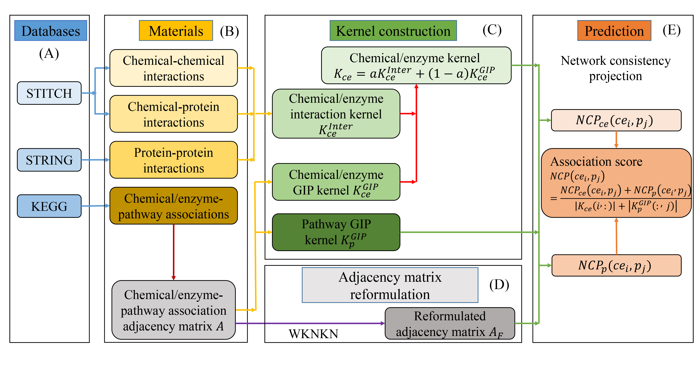

# MBPathNCP

## Datasets
The 'Data' folder contains the raw used in MBPathNCP.Their specific sources are detailed in the paper. The following is a brief introduction on each file:

- Pathways/Path_CID_matrix.csv ：The association between 2329 chemicals and 176 metabolic pathways.
- Pathways/Path_CPC_matrix.csv ：The association between 2329 chemicals,1098 enzymes and 176 metabolic pathways.
- Pathways/Path_ENSP_matrix.csv ：The association between 1098 enzymes and 176 metabolic pathways.

